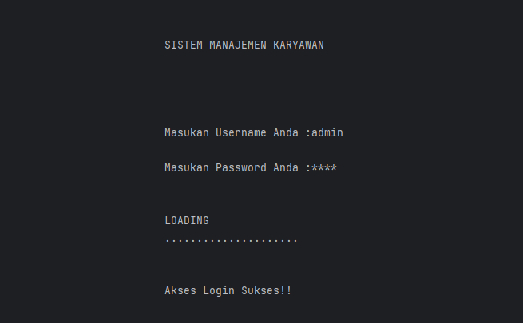
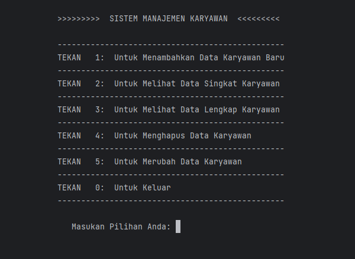

# CRUD Project Managemen Karyawan version 1.0

<p align="center">

</p>

<p align="center">

</p>

<p align="center">
        <a href="https://github.com/nath2006"></a>
</p>

## :heavy_exclamation_mark: Password dan Username
```
Username = admin
Password = pass
```
<details>

<summary>
        Kalian ingin merubah Username dan Passwordnya?
</summary>

### Kalian pun, bisa menganti Username dan Password pada bagian :
`````````````````````````
```````````````
Views/login.cpp 
```````````````
CRUD_PROJECT_VERSION-3.0
│
└─.idea
└─cmake-build-debug
└─dataBase
└─helper
└─model
└─preview-img-readme
└─views
   └──login.cpp
`````````````````````````
Pada baris code dibawah :
```cpp
//Line 38
   if(pass == "pass" && user =="admin"){
        ....
    }
````
Dengan User name dan Password yang kalian mau.
</details>

## :pencil:Requirements 
- C++ IDE (Rekomend pakai Clion aja deh, dari JetBrains)
- Cmake

## :loudspeaker: Note
Untuk versi GUInya coming soon yaw!!!, dengan SQL sebagai Data Basenya :wink:

